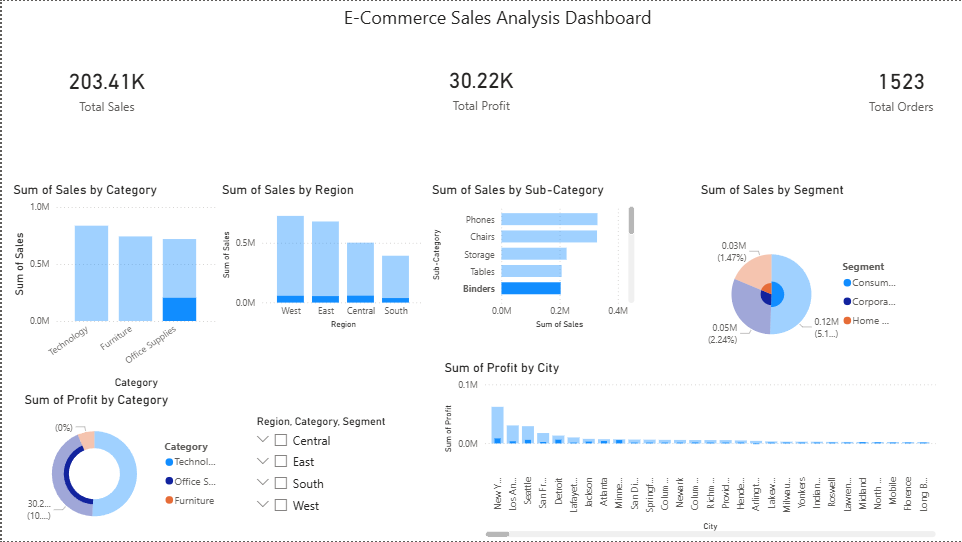

# E-Commerce Sales Analysis Dashboard (Power BI)

This project analyzes e-commerce sales data using **Microsoft Power BI** to generate insights about sales performance, customer segments, and profitability.

## Features

* Sales analysis by category
* Regional sales distribution
* Customer segment analysis
* Profit analysis
* Interactive filters for dynamic exploration

## Tools Used

* Microsoft Power BI
* DAX (Data Analysis Expressions)
* Power Query

## Dataset

Superstore Sales Dataset

## Dashboard Preview

